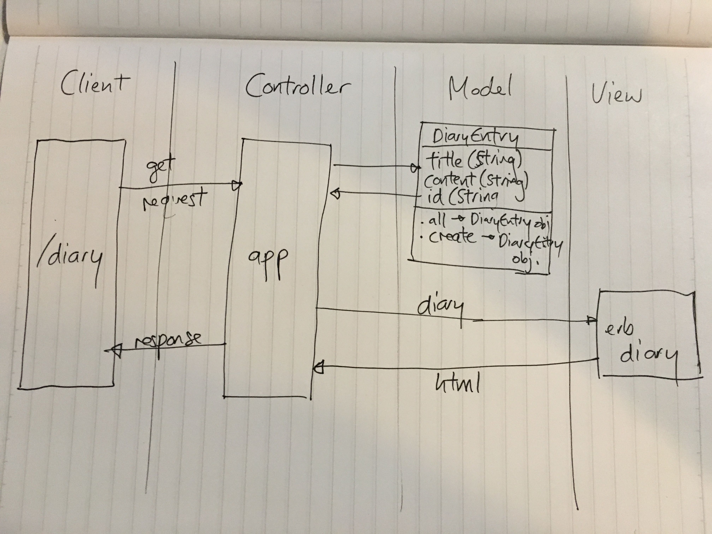

# Daily Diary

A web application for storing diary entries - built with Sinatra and PostgreSQL

### User Stories

```
As a user
So that I can keep a daily diary
I want to be able to add a new Diary Entry

As a user
So that I can identify my entry in future
I want to give each Diary Entry a title

As a user
So that I can browse my previous entries
I want to see a list of Diary Entry Titles

As a user
So that I can read my previous entries
I want to click on a title to see the full Diary Entry
```

### Domain Model


